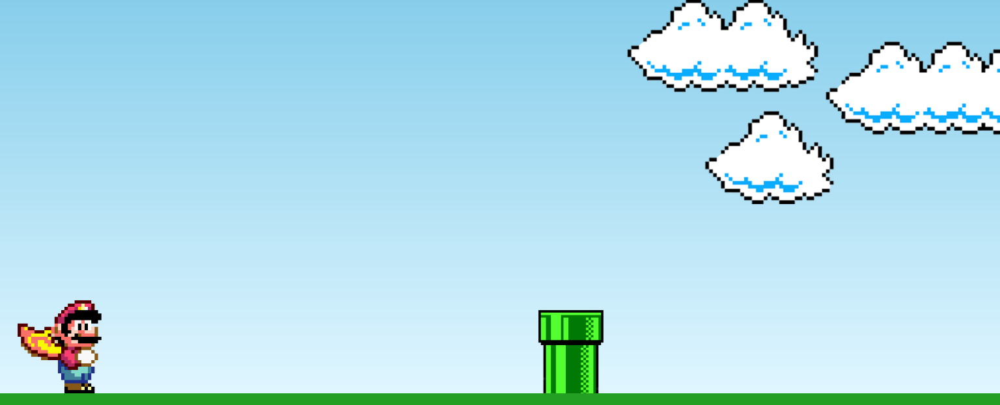
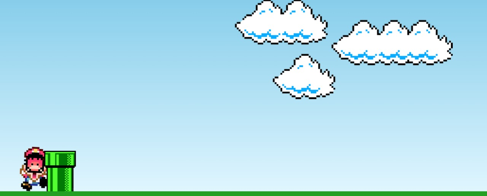

# Mario Jump 🎮🍄

Este é um jogo simples baseado no famoso **Mario Jump**, onde o jogador deve fazer Mario pular para evitar obstáculos (canos). O objetivo é evitar a colisão entre Mario e os canos que se movem na tela. 🚀

## Imagens do Jogo 📸

Aqui estão algumas imagens do jogo:

### Tela de Jogo 🎮

### Tela de Game Over 💀

## Tecnologias Utilizadas 🛠️

- **HTML**: Estruturação da página e do layout do jogo.
- **CSS**: Estilos e animações para o jogo.
- **JavaScript**: Lógica do jogo, animação de Mario e detecção de colisão.

## Como Jogar 🎮

1. **Jogar**: Pressione qualquer tecla (geralmente a tecla de espaço ou seta para cima) para fazer o Mario pular. ⬆️
2. **Evitar Canos**: O objetivo é evitar que o Mario colida com os canos que aparecem de forma constante. 🚧
3. **Fim de Jogo**: O jogo termina quando o Mario colide com um cano, exibindo uma tela de "Game Over". 💥

## Funcionalidades ✨

- **Mario Pula**: A animação de pulo é ativada ao pressionar uma tecla. 🏃‍♂️💨
- **Canos em Movimento**: Os canos se movem de direita para esquerda constantemente. 🌪️
- **Detecção de Colisão**: O jogo verifica se Mario colidiu com os canos. Quando isso acontece, o jogo termina e uma tela de "Game Over" é exibida. ☠️

## 📂 Estrutura de Pastas e Arquivos

- 📁 [*assets*](assets) 🖼️
    - 📁 [*images*](assets/images) 🌅
        - 🖼️ [clouds.png](assets/images/clouds.png) ☁️
        - 🖼️ [mario.gif](assets/images/mario.gif) 🎮
        - 🖼️ [pipe.png](assets/images/pipe.png) 🚧
        - 🖼️ [game-over.png](assets/images/game-over.png) 💀
    - 📁 [*screenshots*](assets/screenshots) 📸
        - 🖼️ [game-over-screen.png](assets/screenshots/game-over-screen.png) 🖼️
        - 🖼️ [game-play.png](assets/screenshots/game-play.png) 🖼️
- 📁 [*css*](css) 🎨
    - 🖌️ [style.css](css/style.css) 🖌️
- 📁 [*js*](js) 💻
    - ⌨️ [script.js](js/script.js) ⌨️
- 📄 [index.html](index.html) 📄
- 📖 [README.md](README.md) 📖